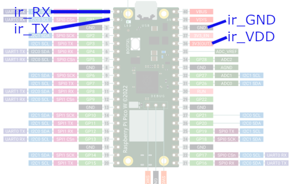

# StromMesser project documentation

## power meter readout using pico_w and micropython
1. project folder pico_w
1. use micropython (version: use the most recent for pico_w, (20221118-unstable did work). use thonny to run/update code)
   1. store main_measure.py as main.py together with other .py files
   1. serial connection with IR header. NB: pico pins not 5V tolerant, 3.3 only. Use 3.3V supply for IR header (37=3.3V_enable has a pull-up)
     * pin36=3.3V (300 mA recommendation)
     * pin38=GND
     * pin01=TX
     * pin02=RX
1. IR-Header (design origin: volkszaehler.org): auf [ebay](https://www.ebay.ch/itm/275076138187?hash=item400bd0c4cb:g:VxwAAOSwbkdhxLJL), Sources [bayha-electronics.de](bayha-electronics.de/download/Bauanleitung-TTL.pdf) 

### Notes
* picosleep to reduce power consumption [picosleep](https://ghubcoder.github.io/posts/deep-sleeping-the-pico-micropython/)


1. display on raspi: nano ~/.config/autostart/chromiumstart.desktop. Inhalt: 
```
[Desktop Entry]
Type=Application
Hidden=false
X-GNOME-Autostart-enabled=true
Comment=Start des Cromium Browsers
Name=chromiumstart
Exec=/usr/bin/chromium-browser --noerrdialogs --disable-session-crashed-bubble --disable-infobars --start-fullscreen https://strommesser.ch/verbrauch/index.php?autoreload=1
```

### Volkszähler info

1. UART communication, source [volkszaehler.org](https://wiki.volkszaehler.org/hardware/channels/meters/power/edl-ehz/landisgyr_e350)
   1. 300bd, 7bit, even parity, 1 stoppbit
   1. init sequenz: /?!<CR><LF> (in hex: 2F 3F 21 0D 0A)
   1. answer: /LGZ4ZMF100AC.M23 (means he could communicate with 4.8 kbaud)
   1. need to ack it: <ACK>000<CR><LF> (in hex: 06 30 30 30 0D 0A)
   1. example answer: 
```
/?!\\
/LGZ4ZMF100AC.M23
000
F.F(00)
C.1.0(12314330)
0.0(00188123        )
C.1.1(        )
1.8.1(001234.120*kWh)
1.8.0(001234.120*kWh)
2.8.0(000000.000*kWh)
15.8.0(001234.120*kWh)
C.7.0(0005)
32.7(229*V)
52.7(230*V)
72.7(230*V)
31.7(000.03*A)
51.7(000.04*A)
71.7(000.09*A)
C.5.0(0400)
0.2.0(M23)
16.7(000.00*kW)
```  
1. parameters explained here [e350 data sheet](http://www.smartenergy.com.ua/files/D000027979%20E350%20ZxF100Ax%20Cx%20series%202%20User%20Manual.pdf)
1. use main.py for the pico side


#### Electrical setup

Also connect GP28 to 3V3_EN to save some power (works though without it)


## Sources


## Div
* [some possible display for raspi](https://www.heise.de/news/Transparentes-OLED-Display-fuer-Raspberry-und-Arduino-Bastelrechner-7269567.html)

